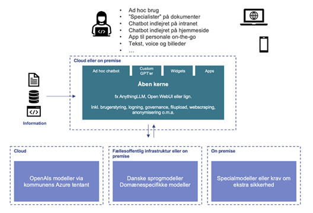

# Baggrund og motivation

AarhusAI er et bud på et supplement/alternativ til værktøjer som ChatGPT og Copilot, der er udviklet ud fra et
kommercielt og teknologidrevet perspektiv uden særlig hensyntagen til det europæiske juridiske grundlag eller
etiske dimensioner i brugen af teknologien.

Det primære behov, som AarhusAI adresserer, er datasikkerheden og derigennem muligheden for at anvende generativ
AI i fagnær opgaveløsning med persondata.

Den globale politiske situation – ikke mindst koblingen mellem amerikansk præsidentpolitik og tech – har skabt
usikkerhed. Der findes eksempler på services, der pludselig er blevet lukket ned af politiske grunde i USA, og
lovgivningen giver de amerikanske efterretningstjenester mulighed for at tilgå data, de finder relevante.

Denne usikkerhed har ført til et ønske om alternativer til de store amerikanske tech-løsninger, som er blevet
stærkt politiserede.

Derfor har vi i Aarhus rettet blikket mod open source-verdenen og har i 2025 sat forskellige komponenter sammen
med ambitionen om at skabe et alternativ til big tech-platformene. Det handler grundlæggende om at sikre handlefrihed
og digital suverænitet.

På den lange bane handler indsatsen om at frigøre ressourcer og tid ved at reducere gentagne opgaver og samtidig sikre,
at data behandles lovligt og sikkert.

AarhusAI er et skridt på vejen mod øget anvendelse af tryg og sikker AI.

## Teknisk løsning eller forandringsredskab?
Arbejdet med at udnytte potentialerne i moderne, generativ kunstig intelligens kræver indsatser på mange fronter
– teknisk såvel som organisatorisk og kompetencemæssigt.

Med afsæt i Aarhus Kommunes tværgående AI-analyse fra 2024 har vi internt italesat en todeling af generativ
AI-feltet: Et spor, der handler om den enkelte medarbejders anvendelse af AI-værktøjer som produktivitets-
og/eller kvalitetsbooster i dagligdagen og et spor, der handler om specifikke AI-løsninger på specifikke
forretningsmæssige udfordringer eller ambitioner, ofte domænespecifikke systemer indkøbt hos ekspert-leverandører.

AarhusAI beskrevet heri adresserer elementer i begge spor, men med særligt fokus på at kunne AI-understøtte den
enkelte medarbejder i egen opgaveløsning samt teams og afdelinger i at kunne bygge enkle AI-løsninger til fælles,
intern opgaveløsning (gennem individuelle, internt delte eller organisationsbrede, ”custom” chatbots baseret på
afgrænset kildemateriale.

Aarhus Kommune består af seks magistratsafdelinger med meget forskellige udgangspunkter – både i forhold til juridiske
krav og rammer og AI-modenhed. Risikoniveauerne varierer ligeledes: At arbejde med vejtræer er ikke det samme som at
håndtere data om børn og udsatte borgere. Derfor bevæger organisationen sig ikke nødvendigvis fremad i samme tempo,
og det stiller krav til fælles mål og succeskriterier på tværs.

Hver magistratsafdeling har egen Digitaliseringschef og sammen spiller de aktuelt en central rolle i at definere
ambitionerne for AarhusAI og for AI arbejdet i kommunen generelt.

I mange organisationer er det udfordrende at skabe en ensartet praksis omkring anvendelsen af generativ AI.
AarhusAI søger at imødekomme en række spørgsmål og udfordringer, som følger deraf: Fragmentering kan skabe usikkerhed
omkring gældende regler og praksis på kommune-niveau, f.eks. i relation til køb af betalte tjenester
(”hvilke offentlige eller betalte tjenester må jeg bruge?”), datasikkerhed (”hvad må jeg bruge denne tjeneste til?”)
eller leverandørlandskabet (”må jeg bruge OpenAI til denne type data, hvis det er via kommunens Azure-aftale?”) og det
bidrager til at skabe et fragmenteret systemlandskab, der på kort tid kan blive ganske svært at strøm-line igen.

Med afsæt til bl.a. Aarhus Kommunes Digitaliseringsstrategis princip om digital handle-frihed er AarhusAI et bud på
en platform, som kan understøtte udbredelsen af generativ AI generelt på en sikker og tryg vis, hvor valg og håndtering
af leverandører, platforme, data og modeller er i hænderne på kommunen selv.

På området for generativ AI står vi som kommunale organisationer i en gunstig situation, hvor det er oplagt at overveje
en leverandørstrategi, der giver stor handlefrihed: Vi har endnu ikke et eksisterende systemlandskab af AI-platforme og
modeller eller eksisterende leverandørafhængigheder, som vi skal tage hensyn til, og som ofte af skifteøkonomiske
årsager dikterer, hvordan vi bør (gen-)anskaffe systemer.

Vi har med andre ord en oplagt mulighed for at ”walk the talk” i forhold til digital handlefrihed, ved at vælge en
kerneplatform, der er open source, men som muliggør brug af både lukkede modeller hos de største
leverandører(Open AI/Azure/Gemini) og åbne modeller (Llama, Mistral, kommende danske modeller mv.) afviklet på selvvalgt
infrastruktur – men hvor kerneplatformen altså ikke dikterer hvilke modeller, der kan anvendes eller som binder os til
en specifik leverandør.

Denne grundtanke har vi tidligt i Aarhus Kommune illustreret i denne konceptuelle arkitektur:

Illustrationen viser (øverst) en række generelle use cases, som alle knytter an til individuel løsning af opgaver
eller lettere adgang til viden gennem øget brug af generativ AI som redskab på tværs af
modaliteter(tekst, billeder, voice) og devices (desktop, mobil, tablets).

I bunden er illustreret fleksibiliteten i at kunne vælge forskellige modeller leveret på forskellige infrastrukturer.

Og slutteligt er ”platformen” (i midten) det, der binder use cases og generative kapabiliteter sammen i en
brugergrænseflade med den nødvendige governance gennem roller og rettigheder samt forskellige brugerrettede features.

Output i enhver model afhænger af Input. ”Shit in – Shit out”. For at lykkes med etableringen af gode AI-løsninger
etableret i AI-platformen kræver det (i venstre side) en indsats på dataområdet for over tid at sikre mere
standardiseret adgang til information fra f.eks. autoritative kildesystemer eller dokumenter i eksisterende
systemer internt i kommunen – altså en indsats i relation til informationsarkitekturen i kommunen.

De generative løsninger bliver med andre ord ikke bedre end de informationer, de bygger på og derfor kan en indsats
for at etablere en generel AI-platform ikke nå ordentligt i mål uden også (på et eller andet niveau) at forholde sig
til kommunens informationsarkitektur omkring data.

Denne del løser AarhusAI ikke.
