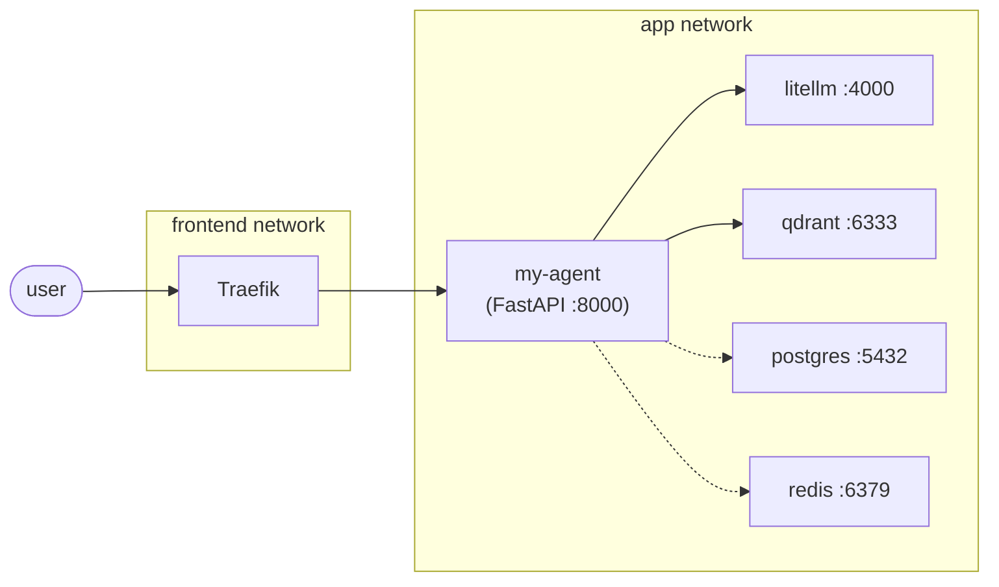

# Building a new agent

A developer guide for creating LLM-backed microservices that live alongside
the [AarhusAI docker](https://github.com/AarhusAI/aarhusai-docker) stack.
The [retrieval-agent](https://github.com/AarhusAI/retrieval-agent) is the worked example throughout - every pattern
documented here is taken from there.

## Table of contents

1. [What this guide is for](#1-what-this-guide-is-for)
2. [Prerequisites](#2-prerequisites)
3. [Glossary](#3-glossary)
4. [Overview](#4-overview)
5. [Recommended stack](#5-recommended-stack)
6. [Repository layout](#6-repository-layout)
7. [Step-by-step setup](#7-step-by-step-setup)
8. [PydanticAI patterns](#8-pydanticai-patterns)
9. [Production - docker compose server](#9-production---docker-compose-sever)
10. [Production builds (multi-arch)](#10-production-builds-multi-arch)
11. [Verification checklist](#11-verification-checklist)
12. [Common pitfalls / FAQ](#12-common-pitfalls--faq)
13. [Reference index](#13-reference-index)

## 1. What this guide is for

This guide is for a developer **new to the project** who's been asked to build an agent-based tool that plugs into the
AarhusAI platform. If you've never seen this codebase before, start here.

[AarhusAI docker](https://github.com/AarhusAI/aarhusai-docker) is the Docker orchestration around a customised fork
of [Open WebUI](https://github.com/open-webui/open-webui) - the AI chat platform users interact with. "Agents" in this
org are **standalone FastAPI microservices** that extend the platform with LLM-backed workflows: retrieval,
summarisation, classification, multi-step reasoning, anything that benefits from running outside the main UI process.
The canonical example shipped today is [retrieval-agent](https://github.com/AarhusAI/retrieval-agent) - a sibling repo
to `AarhusAI-docker/` - every pattern in this guide is taken from it.

This guide focuses on building a *new* agent and is not a tour of the existing stack.

## 2. Prerequisites

### Install on your machine

- **Docker** with buildx (recent Docker Desktop, or `docker-buildx-plugin` on Linux).
- **Go Task** `brew install go-task` (macOS) or `apt install go-task` (Debian/Ubuntu).
  Commands are invoked as `task <name>`.
- An editor of choice. Python 3.11+ locally is helpful for IDE integration, but **all Python tooling actually runs
  inside the container** - no local venv required.

### Access you'll need

- A local clone of [AarhusAI docker](https://github.com/AarhusAI/aarhusai-docker) ideally as a sibling directory to
  where you'll create your new agent.
- A **ghcr.io Personal Access Token** with `write:packages` scope, for publishing production images.
- A **LiteLLM virtual key** if your agent actually calls models - ask whoever owns the stack.
- Read access to the AarhusAI GitHub org for the existing agent repos.

### Knowledge level assumed

- Comfortable with Python and `async`/`await`.
- Have used Docker and docker-compose before (you don't need to be an expert).
- Have read or skimmed FastAPI's tutorial. PydanticAI is introduced with snippets in §8 - no prior exposure needed.

## 3. Glossary

The terms below show up throughout the rest of the doc. Skim once and refer back as needed.

| Term               | Means                                                                                                           | Where you'll see it             |
|--------------------|-----------------------------------------------------------------------------------------------------------------|---------------------------------|
| AarhusAi docker    | This monorepo of Docker orchestration; the "parent stack".                                                      | Throughout                      |
| Open WebUI         | The AI chat platform (forked at AarhusAI/open-webui), the user-facing UI.                                       | Parent stack; not modified here |
| LiteLLM            | LLM proxy at `http://litellm:4000/v1` inside the stack; agents route every LLM call through it.                 | §4, §7, §8, §9                  |
| Qdrant             | Vector database; used by retrieval-agent for RAG.                                                               | §9, retrieval-agent             |
| Traefik            | Reverse proxy / ingress that fronts every public-facing service.                                                | §7.4, §9                        |
| `frontend` network | External Docker network Traefik reads from; every service that takes user traffic joins it.                     | §7.4, §9                        |
| `app` network      | Internal Docker network where services talk to each other (LiteLLM, Qdrant, Postgres, Redis).                   | §7.4, §9                        |
| retrieval-agent    | Canonical example agent. Repo: <https://github.com/AarhusAI/retrieval-agent>.                                   | Throughout                      |
| PydanticAI         | LLM agent framework - bounded loops, tool calls, structured output.                                             | §5, §8                          |
| Go Task            | Task runner (`Taskfile.yml`) used across the stack. `task <name>` typically runs commands inside the container. | §7.5                            |
| ghcr.io            | GitHub Container Registry. Production images publish to `ghcr.io/aarhusai/<repo>`.                              | §10                             |

## 4. Overview

A "new agent" in this stack is a **standalone FastAPI microservice** that:

- Lives in **its own git repository**, sibling to `aarhusai-docker/`.
- Builds a **multi-arch Docker image** (`linux/amd64,linux/arm64`) pushed to **`ghcr.io/aarhusai/<repo-name>`**.
- Runs locally from its own `docker-compose.yml` (optional), joined to the parent stack's `app` network (for
  service-to-service calls like LiteLLM, Qdrant, Postgres, Redis) and Traefik's `frontend` network (for ingress).
- In production, is **referenced as a pre-built image** from the parent stack's `docker-compose.yml` /
  `docker-compose.server.yml` - the parent stack pulls the image, no source mount.



Solid arrows are typical dependencies (almost every agent calls LiteLLM; many call Qdrant). Dashed arrows are optional -
most agents don't need Postgres or Redis directly. The parent stack provides all four; you join the `app` network and
pick what you actually use.

**Use this template when you need:**

- An LLM-backed HTTP endpoint (summarization, classification, extraction, agentic workflows).
- Structured output via PydanticAI.
- Tool-calling against LiteLLM-proxied models.
- A long-lived stateful client (vector DB, blob store, cache).

**Don't use it for:**

- Long-running batch jobs - use a task runner / cron worker pattern instead.
- Pure frontend changes - patch Open WebUI directly via the parent stack's patch system.
- Anything that needs Open WebUI's session/auth context. Open WebUI integration patterns (RAG external retrieval,
  OpenAI-compatible endpoints, tool servers) are out of scope for this guide - wire that up per agent type once the
  service exists.

## 5. Recommended stack

Use this stack unless you have a specific reason not to - sticking with them means future maintainers (and Claude) can
read your repo without context-switching.

| Concern                   | Choice                                                                       | Why                                                                                                  |
|---------------------------|------------------------------------------------------------------------------|------------------------------------------------------------------------------------------------------|
| Web framework             | `fastapi>=0.115` + `uvicorn[standard]>=0.30`                                 | Async, OpenAPI docs for free, mature dep-injection                                                   |
| Config                    | `pydantic-settings>=2.0`                                                     | Env-first, typed, fails fast at import time                                                          |
| Validation                | `pydantic>=2.0`                                                              | Already a peer dep; use the same models for I/O and config                                           |
| Agent loop / tool-calling | `pydantic-ai-slim[openai]>=0.2.0,<1.0`                                       | Bounded iteration, structured output, tool-call retry                                                |
| Single-shot LLM calls     | `httpx>=0.27`                                                                | Talk directly to the OpenAI-compatible API; cheaper than spinning up a PydanticAI Agent for one call |
| HTTP client               | `httpx`                                                                      | Async, used for all outbound HTTP                                                                    |
| Tests                     | `pytest>=8` + `pytest-asyncio>=0.25` (`asyncio_mode=auto`) + `pytest-cov>=7` | Async-native, mature fixtures                                                                        |
| Lint + format             | `ruff>=0.9`                                                                  | One tool, replaces black/isort/flake8                                                                |
| Python                    | `3.12-slim` container, `requires-python = ">=3.11"` in `pyproject.toml`      | Container parity, allows local 3.11 for tooling                                                      |
| Container build           | Docker buildx + QEMU                                                         | Multi-arch (`linux/amd64,linux/arm64`); devs on Apple Silicon need arm64                             |
| Task runner               | Go Task (`Taskfile.yml`)                                                     | Matches parent stack convention                                                                      |

**PydanticAI vs raw httpx - rule of thumb:** if a request hits the LLM more than once (tool-calling, retries, multi-step
reasoning), use PydanticAI. If it's a single completion (extract → respond), use plain `httpx` against the
OpenAI-compatible endpoint. The [retrieval-agent](https://github.com/AarhusAI/retrieval-agent) does both:
[`app/services/agent.py`][s5-agent] for the agent loop, and [`app/services/query_generation.py`][s5-qg] for
single-shot calls.

[s5-agent]: https://github.com/AarhusAI/retrieval-agent/blob/main/app/services/agent.py

[s5-qg]: https://github.com/AarhusAI/retrieval-agent/blob/main/app/services/query_generation.py

## 6. Repository layout

Every file below has a job. The "routes are thin, services hold logic" convention is what keeps an agent readable as it
grows - you can scan the routes to learn the public surface, then dive into services for behaviour.

The canonical sibling-repo structure, mirroring [retrieval-agent](https://github.com/AarhusAI/retrieval-agent):

```text
my-agent/
├── app/
│   ├── __init__.py
│   ├── main.py            # FastAPI app, lifespan, health endpoints
│   ├── config.py          # pydantic-settings - env-driven config
│   ├── auth.py            # Bearer-token middleware
│   ├── models.py          # Request/response schemas (pydantic)
│   ├── routes/            # Route handlers - thin shells, auth + validation only
│   │   ├── __init__.py
│   │   └── <endpoint>.py
│   └── services/          # Business logic - one module per concern
│       ├── __init__.py
│       └── <service>.py
├── tests/
│   ├── __init__.py
│   ├── conftest.py        # Env setup BEFORE app imports + autouse cleanup
│   ├── test_health.py
│   ├── test_auth.py
│   └── services/
│       └── test_<service>.py
├── Dockerfile             # Multi-stage: base → dev → prod
├── docker-compose.yml     # Standalone dev compose
├── Taskfile.yml           # task wrapper (build, test, lint, build:image)
├── pyproject.toml         # deps, ruff, pytest config
├── .env.example           # Required + optional env vars, no secrets
├── .dockerignore          # Allowlist style
├── .gitignore             # Standard Python + .env
├── README.md
└── CLAUDE.md              # Agent-specific Claude Code instructions
```

**Convention: routes are thin, services hold the logic.** A route does (1) auth via `Depends(verify_api_key)`, (2)
request validation via the pydantic body model, (3) one call into `app/services/...`. Everything else lives in services.
Reference: [`retrieval-agent/app/routes/search.py`](https://github.com/AarhusAI/retrieval-agent/blob/main/app/routes/search.py)
is a 20-line shell over [`retrieval-agent/app/services/pipeline.py`](https://github.com/AarhusAI/retrieval-agent/blob/main/app/services/pipeline.py).

## 7. Step-by-step setup

Each subsection introduces *what the file is for* before showing the template. Replace `my-agent` with your repo name
throughout.

### 7.1 Bootstrap the repo

This is the housekeeping that keeps secrets and build artefacts out of git and the Docker build context.

```bash
mkdir my-agent && cd my-agent
git init
```

Once `app/` and `tests/` exist (after §7.6 and §7.10), make sure each Python package directory has an empty
`__init__.py`: `app/`, `app/routes/`, `app/services/`, `tests/`, `tests/services/`. Easy to forget - imports start
failing silently otherwise.

Create `.gitignore`:

```gitignore
__pycache__/
*.py[cod]
*.egg-info/
.pytest_cache/
.ruff_cache/
.coverage
htmlcov/
.env
.env.local
.venv/
```

Create `.dockerignore` (allowlist style - only what the Dockerfile needs):

```dockerfile
# Exclude everything by default (allowlist approach)
*

# Allow only what the Dockerfile needs
!pyproject.toml
!app/

# Deny patterns inside allowed dirs
app/**/__pycache__
app/**/*.pyc
app/**/*.pyo
```

Reference: [`retrieval-agent/.dockerignore`](https://github.com/AarhusAI/retrieval-agent/blob/main/.dockerignore).

### 7.2 `pyproject.toml`

This is the single source of truth for dependencies, the lint/format config, and the test runner config. Container
builds install from this file, so changes here mean rebuilding the container (see §12).

Drop in this template, change `name`/`description`, then add agent-specific deps:

```toml
[project]
name = "my-agent"
version = "0.1.0"
description = "Short description of what this agent does"
requires-python = ">=3.11"
dependencies = [
    "fastapi>=0.115.0",
    "uvicorn[standard]>=0.30.0",
    "pydantic>=2.0",
    "pydantic-settings>=2.0",
    "httpx>=0.27.0",
    "pydantic-ai-slim[openai]>=0.2.0,<1.0",
]

[project.optional-dependencies]
dev = [
    "ruff>=0.9.0",
    "pytest>=8.0",
    "pytest-asyncio>=0.25.0",
    "pytest-cov>=7.0",
]

[build-system]
requires = ["setuptools>=68.0"]
build-backend = "setuptools.build_meta"

[tool.ruff]
target-version = "py311"
line-length = 99
exclude = ["build"]

[tool.ruff.lint]
select = ["E", "W", "F", "I", "UP", "B", "SIM", "RUF"]
ignore = ["B008"]  # Allow Depends() in function defaults (FastAPI pattern)

[tool.ruff.lint.isort]
known-first-party = ["app"]

[tool.pytest.ini_options]
asyncio_mode = "auto"
testpaths = ["tests"]
```

Reference: [`retrieval-agent/pyproject.toml`](https://github.com/AarhusAI/retrieval-agent/blob/main/pyproject.toml).

### 7.3 `Dockerfile`

Multi-stage build: `base` (shared deps) → `dev` (adds lint/test tools - the running container doubles as your test
environment) → `prod` (slimmer image you ship). Both runnable targets run as non-root and expose 8000.

```dockerfile
FROM python:3.12-slim AS base

WORKDIR /app

RUN apt-get update \
 && apt-get install -y --no-install-recommends curl \
 && rm -rf /var/lib/apt/lists/*

COPY pyproject.toml .

# --- Dev target: includes test/lint tools ---
FROM base AS dev
RUN pip install --no-cache-dir ".[dev]"
COPY app/ app/
RUN adduser --system --no-create-home appuser
USER appuser

EXPOSE 8000
HEALTHCHECK CMD curl -f http://localhost:8000/health || exit 1
CMD ["python", "-m", "uvicorn", "app.main:app", "--host", "0.0.0.0", "--port", "8000"]

# --- Prod target: runtime deps only ---
FROM base AS prod
RUN pip install --no-cache-dir .
COPY app/ app/
RUN adduser --system --no-create-home appuser
USER appuser

EXPOSE 8000
HEALTHCHECK CMD curl -f http://localhost:8000/health || exit 1
CMD ["python", "-m", "uvicorn", "app.main:app", "--host", "0.0.0.0", "--port", "8000"]
```

**If your agent needs an on-disk model cache** (HuggingFace, fastembed, etc.), add these lines to *both* `dev` and
`prod` after `COPY app/ app/`, and mount a named volume to `/cache` in `docker-compose.yml`:

```dockerfile
RUN adduser --system --no-create-home appuser \
 && mkdir -p /cache/hf /cache/fastembed \
 && chown -R appuser /cache
USER appuser
```

Docker's named-volume first-mount copies the directory's ownership into the volume, so creating `/cache` as `appuser` is
what lets the non-root process write to the mounted volume. Reference:
[`retrieval-agent/Dockerfile`](https://github.com/AarhusAI/retrieval-agent/blob/main/Dockerfile) (which uses this
pattern for the BM42 sparse model cache).

### 7.4 Docker compose

In development (local), the agent is mounted and built from source.
The [retrieval-agent](https://github.com/AarhusAI/retrieval-agent)'s existing entry (around
`aarhusai-docker/docker-compose.yml:517-560`) is the template.

Add this block to `docker-compose.yml`:

```yaml
services:
  my-agent:
    build:
      dockerfile: Dockerfile
      context: ./my-agent
      target: ${TARGET:-dev}
    command: [ "python", "-m", "uvicorn", "app.main:app", "--host", "0.0.0.0", "--port", "8000", "--reload" ]
    networks:
      - app
      - frontend
    extra_hosts:
      - "host.docker.internal:host-gateway"
    ports:
      - "8000"
    healthcheck:
      test: [ "CMD", "curl", "-f", "http://localhost:8000/health" ]
      interval: 30s
      timeout: 10s
      retries: 3
      start_period: 10s
    environment:
      API_KEY: ${API_KEY:-CHANGE_ME_NOW}
      AGENT_MODEL: ${AGENT_MODEL:-gpt-4o-mini}
      AGENT_API_BASE_URL: ${AGENT_API_BASE_URL:-http://litellm:4000/v1}
      AGENT_API_KEY: ${AGENT_API_KEY:-}
      DEBUG: ${DEBUG:-false}
    volumes:
      - ./my-agent:/app
    labels:
      - "traefik.enable=true"
      - "traefik.docker.network=frontend"
      - "traefik.http.routers.${COMPOSE_PROJECT_NAME}.rule=Host(`${COMPOSE_DOMAIN}`)"
      - "traefik.http.routers.${COMPOSE_PROJECT_NAME}.middlewares=redirect-to-https"
      - "traefik.http.middlewares.redirect-to-https.redirectscheme.scheme=https"
```

Reference:
[`retrieval-agent/docker-compose.yml`](https://github.com/AarhusAI/retrieval-agent/blob/main/docker-compose.yml).

### 7.5 `Taskfile.yml`

Go Task is the dev-experience layer over Docker. `task up`, `task test`, `task lint` etc. all wrap
`docker compose exec my-agent …` under the hood, so every Python command runs *inside* the running container - no local
venv needed. If `task` isn't on your PATH yet, see §2.

```yaml
# https://taskfile.dev
version: "3"

dotenv: [ ".env.local", ".env" ]

vars:
  CONTAINER_RUNTIME: '{{.CONTAINER_RUNTIME | default "docker"}}'
  DOCKER_COMPOSE: '{{.CONTAINER_COMPOSE | default "docker compose"}}'
  SERVICE: my-agent
  PYTHON: "{{.DOCKER_COMPOSE}} exec {{.SERVICE}}"

tasks:
  default:
    desc: Show available tasks
    cmds:
      - task --list

  # --- Code quality ---
  lint:
    desc: Run all linters
    cmds:
      - task: lint:check
      - task: lint:format:check

  lint:check:
    desc: Check code with ruff
    cmds:
      - "{{.PYTHON}} ruff check ."

  lint:fix:
    desc: Fix code issues with ruff
    cmds:
      - "{{.PYTHON}} ruff check --fix ."

  lint:format:
    desc: Format code with ruff
    cmds:
      - "{{.PYTHON}} ruff format ."

  lint:format:check:
    desc: Check code formatting with ruff
    cmds:
      - "{{.PYTHON}} ruff format --check ."

  # --- Testing ---
  test:
    desc: Run all tests
    cmds:
      - "{{.PYTHON}} pytest -v"

  test:coverage:
    desc: Run tests with coverage report
    cmds:
      - "{{.PYTHON}} pytest --cov=app --cov-report=term-missing -v"

  # --- CI ---
  ci:
    desc: Run all CI checks (lint + test)
    cmds:
      - task: lint
      - task: test

  # --- Build & push production image (multi-arch) ---
  build:image:
    desc: "Build and push production image to ghcr.io (multi-arch). Override PLATFORMS to build one arch (e.g. PLATFORMS=linux/amd64) for faster local builds."
    vars:
      IMAGE: ghcr.io/aarhusai/my-agent
      TAG: '{{.TAG | default "latest"}}'
      PLATFORMS: '{{.PLATFORMS | default "linux/amd64,linux/arm64"}}'
    cmds:
      - task: build:image:builder
      - docker buildx build --builder my-agent-builder --platform {{.PLATFORMS}} --target prod -t {{.IMAGE}}:{{.TAG}} --push .

  build:image:builder:
    desc: "Ensure the buildx builder + QEMU binfmt handlers exist (idempotent first-run setup)."
    internal: true
    silent: true
    cmds:
      - cmd: |
          if ! docker buildx inspect my-agent-builder >/dev/null 2>&1; then
            echo "First-run setup: registering QEMU binfmt handlers (cross-arch emulation)..."
            docker run --privileged --rm tonistiigi/binfmt --install all
            echo "Creating buildx builder 'my-agent-builder' (docker-container driver)..."
            docker buildx create --name my-agent-builder --driver docker-container --bootstrap
          fi
```

Reference: [`retrieval-agent/Taskfile.yml`](https://github.com/AarhusAI/retrieval-agent/blob/main/Taskfile.yml).

### 7.6 `app/main.py`

The entry point: FastAPI instance, a `lifespan` context manager for client setup/teardown, and two health endpoints.
Liveness (`/health`) always returns 200 if the process is up. Readiness (`/health/ready`) actually probes downstreams -
that's what the platform's orchestrator uses to decide if your service is ready for traffic.

```python
import logging
from contextlib import asynccontextmanager

from fastapi import FastAPI
from fastapi.responses import JSONResponse

from app.config import settings

# from app.routes.<your_route> import router as <your_router>
# from app.services import <external_clients>

logging.basicConfig(
    level=logging.INFO,
    format="%(asctime)s [%(levelname)s] %(name)s: %(message)s",
)
if settings.debug:
    logging.getLogger("app").setLevel(logging.DEBUG)
log = logging.getLogger(__name__)


@asynccontextmanager
async def lifespan(app: FastAPI):
    log.info("Starting %s", app.title)
    log.info("Agent model: %s (%s)", settings.agent_model, settings.agent_api_base_url)

    # Eagerly initialize long-lived clients here so first-request latency
    # doesn't include connection setup. Example:
    # await some_service.preload()

    yield

    # Shutdown - close every long-lived client.
    # await some_service.close()
    log.info("%s shut down", app.title)


app = FastAPI(
    title="My Agent",
    description="What this agent does",
    version="0.1.0",
    lifespan=lifespan,
)


# app.include_router(<your_router>)


@app.get("/health")
async def health():
    return {"status": "ok"}


@app.get("/health/ready")
async def health_ready():
    """Readiness probe - verifies downstream connectivity."""
    try:
        # Probe each downstream you depend on. Example:
        # await some_service.ping()
        return {"status": "ok"}
    except Exception as exc:
        log.warning("Readiness check failed: %s", exc)
        return JSONResponse(
            status_code=503,
            content={"status": "error", "detail": str(exc)},
        )
```

Reference: [`retrieval-agent/app/main.py`](https://github.com/AarhusAI/retrieval-agent/blob/main/app/main.py).

**Why eager init in lifespan, not lazy in services?** The first request shouldn't pay startup cost (cold model load, DNS
resolution, vector-store capability probes). Lifespan runs once per process; failures here surface as clear startup
errors instead of a confusing 500 on the first request.

### 7.7 `app/config.py`

All runtime config comes from environment variables - no `config.yaml`, no command-line flags. `pydantic-settings` turns
env vars into a typed object you import everywhere. Define every setting with a type and (where reasonable) a default,
and **instantiate `settings` at module level** so `Settings()` runs at import time and crashes fast on missing required
vars.

```python
from pydantic_settings import BaseSettings


class Settings(BaseSettings):
    model_config = {"env_file": ".env", "env_file_encoding": "utf-8", "extra": "ignore"}

    # --- Auth ---
    api_key: str  # required - no default

    # --- LLM (OpenAI-compatible API, typically LiteLLM proxy) ---
    agent_model: str = "gpt-4o-mini"
    agent_api_base_url: str = "http://litellm:4000/v1"
    agent_api_key: str = ""
    agent_timeout: int = 60

    # --- Debug ---
    debug: bool = False

    # --- Server ---
    host: str = "0.0.0.0"
    port: int = 8000


settings = Settings()
```

Things to know:

- `extra: "ignore"` lets the same `.env` carry vars for other tools without choking validation.
- A field without a default is **required** - missing it crashes at import time, which is what you want.
- Document any **cross-system contracts** with an inline comment (e.g., "must match the value the X service was
  configured with"). The [retrieval-agent](https://github.com/AarhusAI/retrieval-agent)'s `embedding_prefix_query` is
  the canonical example.

Reference: [`retrieval-agent/app/config.py`](https://github.com/AarhusAI/retrieval-agent/blob/main/app/config.py).

### 7.8 `app/auth.py`

Bearer-token auth - whoever calls your agent (Open WebUI, another service, a curl command) must include the key in an
`Authorization: Bearer <key>` header. FastAPI's `HTTPBearer` extracts the credential; `hmac.compare_digest` does a
constant-time compare to prevent timing attacks against the key. The dependency returns the validated key so routes can
declare `Depends(verify_api_key)` to gate themselves.

```python
import hmac

from fastapi import Depends, HTTPException, status
from fastapi.security import HTTPAuthorizationCredentials, HTTPBearer

from app.config import settings

_bearer = HTTPBearer()


async def verify_api_key(
        credentials: HTTPAuthorizationCredentials = Depends(_bearer),
) -> str:
    if not hmac.compare_digest(credentials.credentials, settings.api_key):
        raise HTTPException(
            status_code=status.HTTP_401_UNAUTHORIZED,
            detail="Invalid API key",
        )
    return credentials.credentials
```

Reference: [`retrieval-agent/app/auth.py`](https://github.com/AarhusAI/retrieval-agent/blob/main/app/auth.py).
Usage on a route:

```python
@router.post("/do-thing")
async def do_thing(req: MyRequest, _api_key: str = Depends(verify_api_key)) -> MyResponse:
    return await my_service.handle(req)
```

### 7.9 Routes and services

This is where your agent's actual behaviour lives. **Routes do auth + request validation only; services hold the work
** - every agent in this org follows that split, so sticking to it keeps your code familiar to anyone reading it later.
A minimal "echo with LLM completion" example:

`app/models.py`:

```python
from pydantic import BaseModel, Field


class EchoRequest(BaseModel):
    text: str = Field(..., min_length=1, max_length=10_000)


class EchoResponse(BaseModel):
    original: str
    rewritten: str
```

`app/routes/echo.py`:

```python
import logging

from fastapi import APIRouter, Depends

from app.auth import verify_api_key
from app.models import EchoRequest, EchoResponse
from app.services.rewrite import rewrite

log = logging.getLogger(__name__)
router = APIRouter()


@router.post("/echo", response_model=EchoResponse)
async def echo(req: EchoRequest, _api_key: str = Depends(verify_api_key)) -> EchoResponse:
    log.info("Echo request: %d chars", len(req.text))
    rewritten = await rewrite(req.text)
    return EchoResponse(original=req.text, rewritten=rewritten)
```

`app/services/rewrite.py` - single-shot LLM call via `httpx` (no PydanticAI needed for one round-trip):

```python
import httpx

from app.config import settings

_client: httpx.AsyncClient | None = None


def _get_client() -> httpx.AsyncClient:
    global _client
    if _client is None:
        _client = httpx.AsyncClient(
            headers={"Authorization": f"Bearer {settings.agent_api_key}"},
            timeout=settings.agent_timeout,
        )
    return _client


async def close_client() -> None:
    global _client
    if _client is not None:
        await _client.aclose()
        _client = None


async def rewrite(text: str) -> str:
    client = _get_client()
    resp = await client.post(
        f"{settings.agent_api_base_url}/chat/completions",
        json={
            "model": settings.agent_model,
            "messages": [
                {"role": "system", "content": "Rewrite the user message more concisely."},
                {"role": "user", "content": text},
            ],
        },
    )
    resp.raise_for_status()
    return resp.json()["choices"][0]["message"]["content"]
```

> **Don't use `httpx.AsyncClient(base_url=…)` here with a leading-slash path.** httpx follows RFC 3986 URL joining:
`AsyncClient(base_url="http://litellm:4000/v1").post("/chat/completions")` resolves to
`http://litellm:4000/chat/completions` - the `/v1` is dropped, LiteLLM returns 404. Either pass the full URL (as above)
> or use a trailing slash on `base_url` *and* no leading slash on the path.

Don't forget to wire the router in `app/main.py`:

```python
from app.routes.echo import router as echo_router

# inside the file:
app.include_router(echo_router)
```

And close the client on shutdown in `lifespan`:

```python
from app.services import rewrite as rewrite_service

# inside lifespan after `yield`:
await rewrite_service.close_client()
```

**Pattern: module-level client + `close_client()`.** Long-lived async clients are cached at module level (lazy init via
`_get_client()`). Lifespan calls `close_client()` on shutdown. Tests reset `_client = None` between tests (see §7.10).

For multi-step agentic flows, swap `rewrite.py` for a PydanticAI Agent - see §8.

### 7.10 `tests/conftest.py`

Tests run inside the same container as the app, but need to override env vars to point at fake downstreams. **The single
most important rule:** set env vars *before any `app` import*. `Settings()` runs at import time, so by the time
`from app.main import app` finishes, every config decision is baked in - late-set env vars are silently ignored. See §12
if you hit this.

```python
import os

# Override env vars BEFORE any app imports (Settings() runs at import time)
os.environ["API_KEY"] = "test-api-key"
os.environ["AGENT_API_BASE_URL"] = "http://fake-agent:4000/v1"
os.environ["AGENT_API_KEY"] = "fake-agent-key"

import pytest
from httpx import ASGITransport, AsyncClient

from app.config import settings
from app.main import app
from app.services import rewrite

# Belt-and-braces: also force-overwrite attributes in case the container's
# compose env disagrees with what tests expect.
settings.api_key = "test-api-key"


@pytest.fixture
def api_headers():
    return {"Authorization": "Bearer test-api-key"}


@pytest.fixture
async def client():
    transport = ASGITransport(app=app)
    async with AsyncClient(transport=transport, base_url="http://test") as c:
        yield c


@pytest.fixture(autouse=True)
def reset_clients():
    yield
    # Reset module-level clients between tests so a mock in one test doesn't
    # leak into the next. Add every service that caches a client.
    rewrite._client = None
```

Reference: [`retrieval-agent/tests/conftest.py`](https://github.com/AarhusAI/retrieval-agent/blob/main/tests/conftest.py).

Mock external services (the LLM endpoint, vector DBs, …) at the call boundary - typically by patching the module-level
client. `respx` is a useful drop-in for mocking `httpx` calls.

### 7.11 `.env.example`

Human-readable documentation of your agent's runtime knobs. Real secrets go in `.env` (gitignored); `.env.example` is
committed and shows newcomers what they need to set. Document every variable, split required vs optional, never commit a
real `.env`:

```bash
# --- Required ---
API_KEY=change-me

# --- LLM (OpenAI-compatible, typically LiteLLM proxy) ---
AGENT_MODEL=gpt-4o-mini
AGENT_API_BASE_URL=http://litellm:4000/v1
AGENT_API_KEY=
AGENT_TIMEOUT=60

# --- Local dev plumbing ---
COMPOSE_PROJECT_NAME=my-agent
COMPOSE_DOMAIN=my-agent.local.itkdev.dk
DEBUG=false
```

Generate the production `API_KEY` with:

```bash
python -c "import secrets; print(secrets.token_urlsafe(32))"
```

### 7.12 `README.md`

`README.md the public-facing API doc. Cover:

- One-paragraph what-it-does.
- Quick start (`task setup`, env vars to set).
- Endpoint list: method, path, request body, response, auth header.
- `curl` examples for each endpoint.
- Full env var reference (with defaults).

## 8. PydanticAI patterns

**Skip this section on your first build if you only need a single LLM call per request** - the §7.9 `httpx` example is
enough. Come back here when you're adding tool-calling, multi-step reasoning, or structured output that justifies a real
agent loop.

PydanticAI is the recommended framework for any agent that hits the LLM more than once per request (tool-calling,
retries, multi-step). For single-shot calls, stay on `httpx` (§7.9).

The [retrieval-agent](https://github.com/AarhusAI/retrieval-agent)'s
[`app/services/agent.py`](https://github.com/AarhusAI/retrieval-agent/blob/main/app/services/agent.py) is the
canonical worked example for the patterns below.

### 8.1 Single-shot structured output

```python
from pydantic import BaseModel
from pydantic_ai import Agent
from pydantic_ai.models.openai import OpenAIModel
from pydantic_ai.providers.openai import OpenAIProvider

from app.config import settings


class Classification(BaseModel):
    label: str
    confidence: float


_agent: Agent[None, Classification] | None = None


def _get_agent() -> Agent[None, Classification]:
    global _agent
    if _agent is None:
        model = OpenAIModel(
            settings.agent_model,
            provider=OpenAIProvider(
                base_url=settings.agent_api_base_url,
                api_key=settings.agent_api_key,
            ),
        )
        _agent = Agent(model, output_type=Classification, system_prompt="Classify the input.")
    return _agent


async def classify(text: str) -> Classification:
    result = await _get_agent().run(text)
    return result.output
```

### 8.2 Tool-calling loop with per-request state

Use a frozen dataclass for per-request dependencies and tool-side state. Tools mutate the deps to accumulate
side-channel results without dumping the full payload back into the agent's context.

```python
from dataclasses import dataclass, field
from typing import Any

from pydantic_ai import Agent, RunContext
from pydantic_ai.models.openai import OpenAIModel
from pydantic_ai.providers.openai import OpenAIProvider

from app.config import settings


@dataclass
class AgentDeps:
    user_id: str
    full_results: list[dict[str, Any]] = field(default_factory=list)


model = OpenAIModel(
    settings.agent_model,
    provider=OpenAIProvider(
        base_url=settings.agent_api_base_url,
        api_key=settings.agent_api_key,
    ),
)

agent = Agent(
    model,
    deps_type=AgentDeps,
    system_prompt="Use the lookup tool to answer the user's question.",
)


@agent.tool
async def lookup(ctx: RunContext[AgentDeps], query: str) -> list[dict]:
    docs = await my_search(query)  # full results
    ctx.deps.full_results.extend(docs)  # side channel - full payload
    return [{"id": d["id"], "preview": d["text"][:200]} for d in docs]  # truncated for LLM


async def handle(user_id: str, question: str) -> list[dict]:
    deps = AgentDeps(user_id=user_id)
    await agent.run(question, deps=deps)
    return deps.full_results  # return the full payload, NOT the agent's reply
```

**Why side-channel results?** Token budgets. The tool returns the minimal preview the LLM needs to grade relevance; the
full doc bodies / metadata never enter the conversation. The
[retrieval-agent](https://github.com/AarhusAI/retrieval-agent)'s `AGENT_TOOL_PREVIEW_CHARS` (default 200)
caps the per-doc preview, and `AGENT_PREVIEW_K` caps how many previews per tool call. The final API response is built
from `deps.full_results`, not from anything the model saw.

### 8.3 Wall-clock timeout with partial-result return

The agent loop has two budgets: `AGENT_MAX_ITERATIONS` (logical iterations) and a wall-clock timeout. On timeout, return
whatever the tools already wrote to deps.

```python
import asyncio
from pydantic_ai.exceptions import UnexpectedModelBehavior


async def handle(user_id: str, question: str) -> list[dict]:
    deps = AgentDeps(user_id=user_id)
    try:
        await asyncio.wait_for(
            agent.run(question, deps=deps),
            timeout=settings.agent_timeout,
        )
    except (asyncio.TimeoutError, UnexpectedModelBehavior) as exc:
        log.warning("Agent run cut short: %s", exc)
    return deps.full_results
```

### 8.4 Strict-tools toggle

Some models (Mistral, older Llamas) don't support OpenAI's strict tool schemas. Drive strict-mode from an env flag so
you can flip it without code changes:

```python
# app/config.py
agent_strict_tools: bool = True


# app/services/<your_agent>.py
@agent.tool(strict=settings.agent_strict_tools)
async def lookup(ctx: RunContext[AgentDeps], query: str) -> list[dict]:
    ...
```

Set `AGENT_STRICT_TOOLS=false` in `.env` for models that need it. Apply the same `strict=settings.agent_strict_tools` to
every tool the agent owns.

### 8.5 Fallback parser for off-protocol output

When the model emits tool calls as plain text or vendor-specific syntax (e.g. Mistral's `[TOOL_CALLS]`) instead of an
OpenAI tool call, parse it manually. Reference: `_parse_fallback_queries()` in
[`retrieval-agent/app/services/agent.py`](https://github.com/AarhusAI/retrieval-agent/blob/main/app/services/agent.py).
Pattern: try JSON, then regex for vendor syntax, then bail; wrap downstream calls in try/except so embedding/DB failures
inside the fallback return empty results, not 500s.

### 8.6 Pointing at LiteLLM

From inside a container on the `app` network: `AGENT_API_BASE_URL=http://litellm:4000/v1`. From outside (e.g. `task` on
the host, or a non-stack environment): `https://litellm.itkdev.dk/v1`.

## 9. Production - docker compose sever

In production, the agent is **not built from source**.
The [retrieval-agent](https://github.com/AarhusAI/retrieval-agent)'s existing entry (around
`aarhusai-docker/docker-compose.server.yml:517-560`) is the template. Add this block to `docker-compose.server.yml`:

```yaml
  my-agent:
    image: ghcr.io/aarhusai/my-agent:${MY_AGENT_VERSION:-latest}
    restart: unless-stopped   # production only - omit in docker-compose.yml
    command:
      - "python"
      - "-m"
      - "uvicorn"
      - "app.main:app"
      - "--host"
      - "0.0.0.0"
      - "--port"
      - "8000"
    networks:
      - app
      - frontend
    ports:
      - "8000"
    environment:
      API_KEY: ${MY_AGENT_API_KEY:?}
      AGENT_MODEL: ${MY_AGENT_MODEL:-gpt-4o-mini}
      AGENT_API_BASE_URL: ${MY_AGENT_API_BASE_URL:-http://litellm:4000/v1}
      AGENT_API_KEY: ${MY_AGENT_API_KEY_LLM:?}
      DEBUG: ${MY_AGENT_DEBUG:-false}
    healthcheck:
      test: [ "CMD", "curl", "-f", "http://localhost:8000/health" ]
      interval: 30s
      timeout: 10s
      retries: 3
      start_period: 10s
    depends_on:
      # Only declare deps for services your agent actually needs.
      litellm:
        condition: service_started
    labels:
      - "traefik.enable=true"
      - "traefik.docker.network=frontend"
      - "traefik.http.routers.my-agent.rule=Host(`my-agent.${COMPOSE_SERVER_DOMAIN}`)"
      - "traefik.http.routers.my-agent.middlewares=redirect-to-https"
      - "traefik.http.middlewares.redirect-to-https.redirectscheme.scheme=https"
```

Then add the env vars to the parent stack's `.env` (or `.env.default` if they have sensible defaults):

```bash
MY_AGENT_VERSION=v0.1.0
MY_AGENT_API_KEY=<secrets.token_urlsafe(32)>
MY_AGENT_API_KEY_LLM=<LiteLLM virtual key>
```

Things to know:

- Sanity-check the diff with `docker compose -f docker-compose.server.yml config` before merging.

## 10. Production builds (multi-arch)

You'll push to ghcr.io, which requires a Personal Access Token (one-time setup) - see §2 Prerequisites for what scope it
needs. There is no GitHub Actions pipeline in this org; releases are triggered by hand via `task build:image`.

The agent is built and pushed to **`ghcr.io/aarhusai/<repo-name>`** for both `linux/amd64` (production servers) and
`linux/arm64` (Apple Silicon devs).

### 10.1 One-time setup

You need a ghcr.io Personal Access Token with `write:packages`:

```bash
echo "$GHCR_TOKEN" | docker login ghcr.io -u <github-username> --password-stdin
```

The buildx builder + QEMU binfmt handlers are bootstrapped automatically on the first `task build:image` (see the
`build:image:builder` task in §7.5).

### 10.2 Build & push

```bash
# Tagged release (recommended)
task build:image TAG=v0.1.0

# Latest only
task build:image

# Faster local build - single arch, useful for iterating
task build:image TAG=v0.1.0-dev PLATFORMS=linux/amd64
```

Important details:

- **`--target prod`** - never push the dev image. Prod target has no test/lint tools and a smaller surface.
- **`--push`** - multi-arch manifests can only be pushed; Docker's local image store doesn't hold them.
  `task build:image` hardcodes `--push`. To test a built image locally *without* pushing, bypass the task and run
  `docker buildx build --target prod --platform linux/amd64 --load -t my-agent:test .` directly (single-arch only -
  `--load` doesn't work with multi-arch).
- **Two tags per release:** push both `vX.Y.Z` and `latest`. The Taskfile only pushes one tag at a time; run it twice:

  ```bash
  task build:image TAG=v0.1.0
  task build:image TAG=latest
  ```

## 11. Verification checklist

Walk through this before declaring your new agent done.

- [ ] **Skeleton builds.** `task build` succeeds from a clean checkout.
- [ ] **Service starts.** `task up` brings the container healthy (`docker compose ps` shows `(healthy)`).
- [ ] **Health endpoints respond.** From inside the container itself - `task shell`, then:

  ```bash
  curl http://localhost:8000/health
  curl http://localhost:8000/health/ready
  ```

  Or via the public Traefik URL from your host: `curl -k https://${COMPOSE_DOMAIN}/health` (uses your `.env`).
- [ ] **Auth works.** From `task shell`, against the `/echo` example endpoint:

  ```bash
  # Wrong key → 401
  curl -H "Authorization: Bearer wrong" -H "Content-Type: application/json" \
       -d '{"text":"hi"}' http://localhost:8000/echo
  # Correct key → 200
  curl -H "Authorization: Bearer $API_KEY" -H "Content-Type: application/json" \
       -d '{"text":"hi"}' http://localhost:8000/echo
  ```

- [ ] **`task ci` is green.** Lint + format check + tests pass.
- [ ] **`task test:coverage`** reports coverage and prints the missing-lines table.
- [ ] **Single-arch build works.** `task build:image TAG=v0.0.1-test PLATFORMS=linux/amd64` - verify against a registry
  you control, then untag.
- [ ] **Multi-arch build works.** `task build:image TAG=v0.0.1-test` produces a manifest list. Inspect with
  `docker buildx imagetools inspect ghcr.io/aarhusai/my-agent:v0.0.1-test` - should show both `linux/amd64` and
  `linux/arm64`.
- [ ] **Parent compose parses.** Add the service block from §9b to a working copy of the parent compose; run
  `docker compose -f docker-compose.yml -f docker-compose.server.yml config` - exits 0 and emits the resolved YAML.
- [ ] **README documents the public API.** Endpoints, auth header, request/response examples, env var reference. Use the
  [retrieval-agent's `README.md`](https://github.com/AarhusAI/retrieval-agent/blob/main/README.md) as a model.

## 12. Common pitfalls / FAQ

The traps below catch nearly every newcomer at least once. Skim now; come back when something breaks.

**1. `task up` fails with "frontend network does not exist."**
The parent `openwebui-docker` stack (which owns Traefik) isn't running, or you haven't created the network yourself.
Either start the parent stack first, or `docker network create frontend` if you're running standalone.

**2. `task: command not found`.**
Go Task isn't installed - and it's *not* GNU `make`. Install it: `brew install go-task` (macOS) or
`apt install go-task` (Debian/Ubuntu). See §2.

**3. Env var changes aren't picked up.**
Task loads `.env.local` then `.env` via the `dotenv:` directive at the top of `Taskfile.yml`. After editing `.env`,
recreate the container (`task restart`) - `up -d` alone won't push new env into a running container.

**4. Hot reload doesn't pick up file changes.**
Check that `docker-compose.yml` has *both* `volumes: ./:/app` *and* `--reload` on the uvicorn command. Editing files
outside `./` won't propagate. On macOS, large `node_modules`-style directories also slow the file-event delivery - keep
them out of the mounted tree.

**5. Tests can't see my env overrides - `Settings()` still has the container env.**
`Settings()` runs at import time. `os.environ[...] = ...` must happen *before* `from app.main import app`. The
`tests/conftest.py` template (§7.10) puts env writes at the top of the file for this reason.

**6. `task build:image` fails: `denied: permission_denied` to ghcr.io.**
You haven't logged in. `echo $GHCR_TOKEN | docker login ghcr.io -u <github-username> --password-stdin`. The PAT needs
`write:packages` scope.

**7. `task build:image` fails: "multiple platforms feature is currently not supported for docker driver."**
The buildx builder didn't get created (or wasn't selected). Run `task build:image:builder` directly, or delete the
existing builder and retry: `docker buildx rm my-agent-builder`.

**8. On Apple Silicon, the multi-arch build is painfully slow.**
The `linux/amd64` half builds under QEMU emulation. For local iteration, build only your native arch:
`task build:image PLATFORMS=linux/arm64`. The full multi-arch build is only needed for the actual release push.

**9. Agent can't reach LiteLLM.**
Container-internal URL is `http://litellm:4000/v1`; external is `https://litellm.itkdev.dk/v1`. If you point the
container at the external URL by mistake, you'll either hit the public internet (and probably hit a firewall) or fail
TLS verification. The same virtual key works at both URLs.

**10. Healthcheck shows `(unhealthy)`.**
`curl` must be available inside the image. The Dockerfile template installs it in the `base` stage (
`apt-get install curl`). If you copied a slimmer base or removed the install line, the healthcheck silently fails and
the container stays `(unhealthy)`.

**11. `pip install` from your laptop fails or hangs.**
Don't install Python deps on the host. Every Python tool runs inside the container: `task install`, or `task shell` then
`pip ...`. The whole point of the Taskfile wrapper is that you never set up a local venv.

**12. Added a dep to `pyproject.toml` but `task test` still errors with `ImportError`.**
The container only re-installs deps when rebuilt. After editing `pyproject.toml`: `task build && task restart`, or just
`task install` to install into the *running* container without a rebuild (faster for iteration).

**13. `task lint` / `task test` says "service my-agent is not running."**
Most tasks shell into a *running* container via `docker compose exec`. You need `task up` first.

**14. Traefik shows "no route" or 404 for your agent's host.**
Check that `${COMPOSE_PROJECT_NAME}` and `${COMPOSE_DOMAIN}` are set (Taskfile loads them via dotenv) and that they
match the labels in your compose. Verify with `docker compose config` - if the rendered `Host(...)` is empty, the env
var didn't propagate.

**15. Works locally, won't start in production: `Permission denied: '/cache/...'`.**
The non-root `appuser` doesn't own a volume that was mounted before the ownership fix. Recreate the named volume (
`docker volume rm <vol>`), and double-check that the Dockerfile `chown -R appuser /cache` runs in the *prod* target
too - easy to add to dev only and forget.

---

## 13. Reference index

Every file in [retrieval-agent](https://github.com/AarhusAI/retrieval-agent) this guide leans on - open these when
you're stuck. All `retrieval-agent/...` paths below link to `main` on GitHub.

| File                                                              | What to look at                                                                                     |
|-------------------------------------------------------------------|-----------------------------------------------------------------------------------------------------|
| [`retrieval-agent/Dockerfile`][ra-dockerfile]                     | Multi-stage base → dev → prod, non-root user, model cache pattern                                   |
| [`retrieval-agent/docker-compose.yml`][ra-compose]                | Networks, healthcheck, Traefik labels, `target: ${TARGET:-dev}`                                     |
| [`retrieval-agent/Taskfile.yml`][ra-taskfile]                     | Full task catalogue; `build:image` + `build:image:builder` for multi-arch                           |
| [`retrieval-agent/pyproject.toml`][ra-pyproject]                  | Deps, optional dev deps, ruff + pytest config                                                       |
| [`retrieval-agent/.dockerignore`][ra-dockerignore]                | Allowlist-style exclude-everything-then-allow pattern                                               |
| [`retrieval-agent/app/main.py`][ra-main]                          | FastAPI app, lifespan eager init, health + readiness endpoints                                      |
| [`retrieval-agent/app/config.py`][ra-config]                      | pydantic-settings pattern, cross-system contract comments                                           |
| [`retrieval-agent/app/auth.py`][ra-auth]                          | `HTTPBearer` + `hmac.compare_digest` constant-time check                                            |
| [`retrieval-agent/app/routes/search.py`][ra-search]               | Thin route shell - auth + validation + service call                                                 |
| [`retrieval-agent/app/services/pipeline.py`][ra-pipeline]         | Where the actual work lives                                                                         |
| [`retrieval-agent/app/services/agent.py`][ra-agent]               | PydanticAI agent loop, side-channel results, fallback parser, timeout handling, strict-tools toggle |
| [`retrieval-agent/app/services/query_generation.py`][ra-qg]       | Single-shot LLM call via httpx (no PydanticAI)                                                      |
| [`retrieval-agent/tests/conftest.py`][ra-conftest]                | Env-before-import setup + autouse client reset fixture                                              |
| [`retrieval-agent/.env.example`][ra-envexample]                   | Documented env var template                                                                         |
| [`retrieval-agent/README.md`][ra-readme]                          | Public-facing API docs and config reference                                                         |
| [`retrieval-agent/CLAUDE.md`][ra-claude]                          | Non-obvious internals worth capturing for future maintainers                                        |
| [`aarhusai-docker/docker-compose.yml`][ad-compose]                | Dev embedding pattern in the parent stack (service `retrieval`)                                     |
| [`aarhusai-docker/docker-compose.server.yml`][ad-compose-server]  | Production embedding pattern with `restart: unless-stopped` (service `retrieval`)                   |

[ra-dockerfile]: https://github.com/AarhusAI/retrieval-agent/blob/main/Dockerfile

[ra-compose]: https://github.com/AarhusAI/retrieval-agent/blob/main/docker-compose.yml

[ra-taskfile]: https://github.com/AarhusAI/retrieval-agent/blob/main/Taskfile.yml

[ra-pyproject]: https://github.com/AarhusAI/retrieval-agent/blob/main/pyproject.toml

[ra-dockerignore]: https://github.com/AarhusAI/retrieval-agent/blob/main/.dockerignore

[ra-main]: https://github.com/AarhusAI/retrieval-agent/blob/main/app/main.py

[ra-config]: https://github.com/AarhusAI/retrieval-agent/blob/main/app/config.py

[ra-auth]: https://github.com/AarhusAI/retrieval-agent/blob/main/app/auth.py

[ra-search]: https://github.com/AarhusAI/retrieval-agent/blob/main/app/routes/search.py

[ra-pipeline]: https://github.com/AarhusAI/retrieval-agent/blob/main/app/services/pipeline.py

[ra-agent]: https://github.com/AarhusAI/retrieval-agent/blob/main/app/services/agent.py

[ra-qg]: https://github.com/AarhusAI/retrieval-agent/blob/main/app/services/query_generation.py

[ra-conftest]: https://github.com/AarhusAI/retrieval-agent/blob/main/tests/conftest.py

[ra-envexample]: https://github.com/AarhusAI/retrieval-agent/blob/main/.env.example

[ra-readme]: https://github.com/AarhusAI/retrieval-agent/blob/main/README.md

[ra-claude]: https://github.com/AarhusAI/retrieval-agent/blob/main/CLAUDE.md

[ad-compose]: https://github.com/AarhusAI/aarhusai-docker/blob/main/docker-compose.yml

[ad-compose-server]: https://github.com/AarhusAI/aarhusai-docker/blob/main/docker-compose.server.yml
