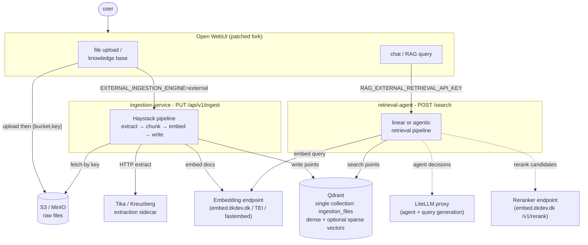
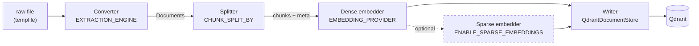
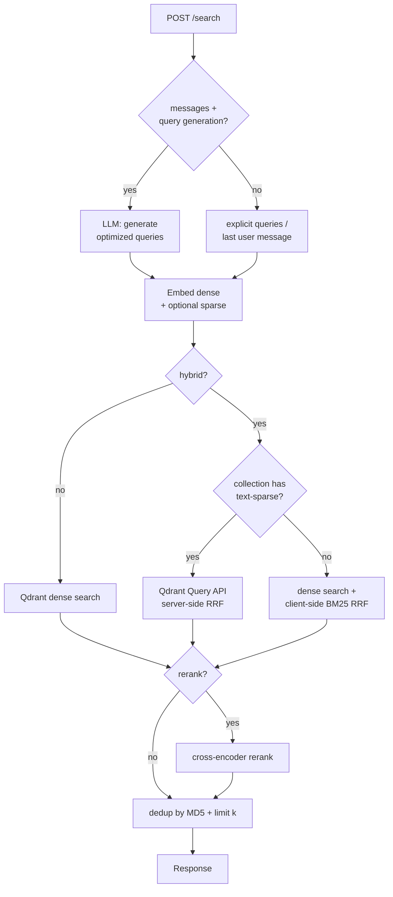
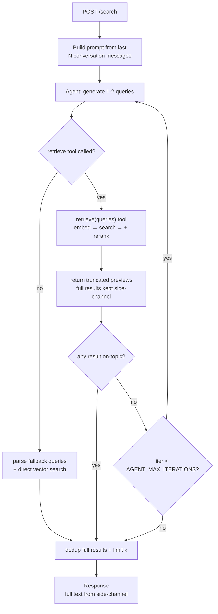

# RAG architecture

Retrieval-augmented generation (RAG) works in AarhusAI with external ingestion and retrieval outside of
[Open WebUI](https://github.com/open-webui/open-webui) into two dedicated microservices that share a single
[Qdrant](https://qdrant.tech/) index:

- [ingestion-service](https://github.com/AarhusAI/ingestion-service) - extracts, chunks, embeds and **writes** documents
  to Qdrant.
- [retrieval-agent](https://github.com/AarhusAI/retrieval-agent) - **reads** Qdrant at query time, optionally wrapping
  the search in an LLM-driven reasoning loop.

## Table of contents

1. [Overview](#1-overview)
2. [Architecture at a glance](#2-architecture-at-a-glance)
3. [The shared Qdrant contract](#3-the-shared-qdrant-contract)
4. [Ingestion path](#4-ingestion-path)
5. [Retrieval path](#5-retrieval-path)
6. [Configuration touchpoints](#6-configuration-touchpoints)
7. [Operations and health](#7-operations-and-health)
8. [Reference](#8-reference)

## 1. Overview

Previously Open WebUI ran the whole RAG flow internally: it extracted text (optionally through an external document
loader), chunked it, embedded it, stored vectors in its own per-knowledge collections, and ran a fixed linear retrieval
at query time.

Why the change:

- **Control over extraction and chunking.** The ingestion-service runs a [Haystack v2](https://haystack.deepset.ai/)
  pipeline with pluggable extraction engines (Tika, Kreuzberg, pypdf, …) and chunking strategies (token, markdown,
  sentence, …) selected by configuration.
- **Hybrid search and reranking.** Ingestion can write a sparse vector alongside the dense one, letting retrieval use
  Qdrant's native RRF hybrid query plus optional cross-encoder reranking.
- **Agentic retrieval.** The retrieval-agent can wrap search in a [PydanticAI](https://ai.pydantic.dev/) loop that
  rewrites queries, decomposes them, grades relevance, and retries - or fall back to a fast linear pipeline.
- **Decoupling.** Either service can be swapped, scaled, or reconfigured without touching the Open WebUI fork.

> The older "document ingestion route" described in [Deployment](./installation/deployment.md) was only a text
> *extraction* proxy - Open WebUI still embedded and stored the result itself. The ingestion-service replaces that by
> taking over embedding and storage as well.

## 2. Architecture at a glance

Both services are standalone FastAPI microservices. They never call each other their only shared state is the Qdrant
index.

Solid arrows are always-on; dashed arrows are optional (the LLM is only consulted in agentic mode or when query
generation is enabled; the reranker only when `ENABLE_RERANKING` is enabled).

## 3. The shared Qdrant contract

This is the most important thing to get right. Both services talk to the **same physical Qdrant collection**
(`ingestion_files` by default) but neither discovers the other's schema - the compatibility is entirely a matter of
matching configuration. A mismatch produces *silently wrong* results (garbage similarity scores, empty hits) rather
than errors.

The settings that must agree across ingestion-service and retrieval-agent:

| Setting | ingestion-service | retrieval-agent | Why it must match |
| --- | --- | --- | --- |
| Qdrant instance | `QDRANT_URI` | `QDRANT_URI` | Same store, or retrieval reads nothing |
| Collection | `QDRANT_INDEX` (`ingestion_files`) | `QDRANT_INDEX` (`ingestion_files`) | Must name the same physical collection |
| Dense model | `EMBEDDING_MODEL` | `EMBEDDING_MODEL` | Different models → incomparable vector spaces |
| Doc/query prefix | `EMBEDDING_PREFIX_DOC` (e.g. `"passage: "`) | `EMBEDDING_PREFIX_QUERY` (e.g. `"query: "`) | e5/nomic models expect their trained prefix |
| Sparse model | `SPARSE_EMBEDDING_MODEL` (when sparse on) | `SPARSE_QUERY_MODEL` (when hybrid on) | Sparse query vectors must match the indexed ones |

**Multitenancy.** Every chunk is written with a `meta.collection_name` payload (e.g. `file-abc`, or a knowledge-base
name) and Qdrant is configured for per-tenant subgraphs keyed on that field
(`hnsw_config={"m": 0, "payload_m": 16}`, with the keyword payload index created at ingestion startup). At query time
the retrieval-agent passes `collection_names` and filters on `meta.collection_name ∈ collection_names`, so one Open
WebUI knowledge base never bleeds into another even though they share one physical collection.

> The dense embedding model is the contract that breaks most quietly. If ingestion indexed with
> `intfloat/multilingual-e5-large` and `"passage: "` prefixes, the retrieval-agent must query with the *same* model and
> the matching `"query: "` prefix - otherwise scores are meaningless but no error is raised.

## 4. Ingestion path

Open WebUI uploads the raw file to S3/MinIO first, then calls `PUT /api/v1/ingest` with the bucket and key (a multipart
body is the fallback for direct uploads). The S3 path is preferred because it keeps large files off the FastAPI
worker's heap.

The request handler hands the file to a Haystack v2 pipeline built once at startup and cached as module state:

1. **Convert** - turn the raw file into Haystack `Document`s. The engine is chosen by `EXTRACTION_ENGINE`: `kreuzberg`
   are HTTP sidecars in the parent stack, `pypdf` is in-process, `docling`/`unstructured` need optional
   dependencies. Kreuzberg additionally surfaces document metadata (title, authors, languages) and renders tables as
   Markdown.
2. **Chunk** - slice documents by `CHUNK_SPLIT_BY`. The default `token` mode measures chunk size in the embedding
   model's actual tokens (important for e5-large's 512-token cap once the `"passage: "` prefix is added); `markdown`
   mode splits on heading hierarchy and records a heading breadcrumb; `word`/`sentence`/`passage` use Haystack's
   built-in splitter. Every chunk gets a sequential `meta.split_id`.
3. **Embed (dense)** - required. `EMBEDDING_PROVIDER` selects `openai-compat` (the current `embed.itkdev.dk` path),
   `fastembed` (in-process), or `tei`. `EMBEDDING_PREFIX_DOC` is prepended to each chunk.
4. **Embed (sparse)** - optional. When `ENABLE_SPARSE_EMBEDDINGS=true`, a second named vector (BM42 / SPLADE family) is
   added per chunk so retrieval can use Qdrant's native RRF hybrid query instead of client-side BM25.
5. **Write** - `DocumentWriter` backed by `QdrantDocumentStore` writes one point per chunk carrying the dense vector
   (and the sparse vector when enabled) as named vectors.

**Idempotency.** With `overwrite=true` (the default), all existing points whose `meta.file_id` matches the request are
deleted before the new chunks are written; the same delete runs as teardown if any stage throws. So a `status: true`
response means the file is *fully* indexed, any other outcome means its chunks are absent (no partial writes leak), and
retrying the same `file_id` never duplicates vectors. Open WebUI's reindex action relies on this.

There is also a developer-facing `POST /api/v1/extract` probe that runs only the converter and returns the raw extracted
documents - useful for comparing extraction engines without a full ingest.

## 5. Retrieval path

Open WebUI calls `POST /search` (authenticated with `RAG_EXTERNAL_RETRIEVAL_API_KEY`) with either explicit `queries` or
the raw chat `messages`, plus the `collection_names` to search and a `k`. The response is one document list per query,
each with a parallel `distances` list -- higher always means more relevant, but the score *scale* depends on the active
path: normalized cosine in `[0, 1]` for plain dense search, Qdrant's raw RRF fusion scores when hybrid is enabled, and
the cross-encoder's relevance scores when reranking is enabled. `ENABLE_AGENTIC_RAG` selects which pipeline runs.

### Linear mode (`ENABLE_AGENTIC_RAG=false`)

A fast, deterministic pipeline:

The hybrid branch is capability-aware: if the collection carries a `text-sparse` vector (because ingestion wrote one),
it uses Qdrant's server-side RRF; otherwise it falls back to scrolling the filtered content into memory for client-side
BM25 fusion. When reranking is on, the initial fetch is `k × INITIAL_RETRIEVAL_MULTIPLIER` candidates, rescored down
to `k` by an external `/v1/rerank` endpoint (default `embed.itkdev.dk`); if that call fails the pipeline falls back to
the unranked candidates rather than erroring. Results are deduplicated by content hash.

### Agentic mode (`ENABLE_AGENTIC_RAG=true`)

A PydanticAI tool-calling loop that reuses the *same* retrieval helpers but lets an LLM drive query formulation and
relevance grading:

Key behaviours:

- The agent is told to generate 1–2 queries, call `retrieve` once, **accept** if *any* returned document is on-topic,
  and only **retry** with rewritten queries when results are completely off-topic.
- A **side-channel** (`AgentDeps.full_results`) accumulates the full retrieval results across iterations, while the tool
  only returns truncated previews to the LLM (`AGENT_PREVIEW_K` items, `AGENT_TOOL_PREVIEW_CHARS` each) so the context
  window doesn't balloon on retries. The final response uses the full text, not the previews.
- If the model emits queries as plain text instead of a tool call, a **fallback** parses them and runs a direct vector
  search (rerank skipped).
- `AGENT_TIMEOUT` is wall-clock; on timeout whatever was already retrieved is returned (partial results, not a 500).
- Agentic mode adds roughly 2–5× latency and 2–4× token cost per query.

## 6. Configuration touchpoints

All settings are environment variables. The tables below show only the cross-service and Open WebUI-facing ones; each
repo's `.env.example` is the full list.

### Open WebUI → the two services

| Open WebUI variable | Points at | Must equal |
| --- | --- | --- |
| `EXTERNAL_INGESTION_ENGINE=external` | ingestion-service | - (switch that enables external ingestion) |
| `EXTERNAL_INGESTION_API_KEY` | ingestion-service | ingestion-service `API_KEY` |
| `RAG_EXTERNAL_RETRIEVAL_API_KEY` | retrieval-agent | retrieval-agent `API_KEY` |

In the parent `docker-compose`, a single `INGESTION_API_KEY` is forked into the ingestion-service's `API_KEY` and Open
WebUI's `EXTERNAL_INGESTION_API_KEY`; likewise `RETRIEVAL_API_KEY` is forked into the retrieval-agent's `API_KEY` and
Open WebUI's `RAG_EXTERNAL_RETRIEVAL_API_KEY` - you do not set those by hand. The retrieval-agent's *agent LLM* key is
separate (`RETRIEVAL_AGENT_API_KEY` → `AGENT_API_KEY`).

### ingestion-service (selected)

| Variable | Default | Notes |
| --- | --- | --- |
| `API_KEY` | *(required)* | Must equal Open WebUI's `EXTERNAL_INGESTION_API_KEY` |
| `QDRANT_INDEX` | `ingestion_files` | Physical collection; must match retrieval-agent |
| `EMBEDDING_MODEL` | `intfloat/multilingual-e5-large` | Must match retrieval-agent |
| `EMBEDDING_PREFIX_DOC` | `"passage: "` | Doc-side prefix (keep the trailing space) |
| `EXTRACTION_ENGINE` | `tika` | `tika` / `pypdf` / `kreuzberg` day-one; `docling` / `unstructured` optional |
| `CHUNK_SPLIT_BY` | `token` | `token` / `markdown` / `word` / `sentence` / `passage` |
| `ENABLE_SPARSE_EMBEDDINGS` | `false` | Adds the sparse vector that enables native hybrid retrieval |

### retrieval-agent (selected)

| Variable | Default | Notes |
| --- | --- | --- |
| `API_KEY` | *(required)* | Must equal Open WebUI's `RAG_EXTERNAL_RETRIEVAL_API_KEY` |
| `QDRANT_INDEX` | `ingestion_files` | Must match ingestion-service |
| `EMBEDDING_MODEL` | `intfloat/multilingual-e5-large` | Must match ingestion-service |
| `EMBEDDING_PREFIX_QUERY` | `"query: "` | Query-side prefix |
| `ENABLE_HYBRID_SEARCH` | `false` | Native sparse+dense when available, else BM25 fallback |
| `ENABLE_RERANKING` | `false` | Cross-encoder rerank stage |
| `ENABLE_QUERY_GENERATION` | `true` | LLM query generation from chat (linear pipeline) |
| `ENABLE_AGENTIC_RAG` | `false` | Route to the agentic loop instead of the linear pipeline |
| `AGENT_MODEL` | `gpt-4o-mini` | Model for agent decisions / query generation |

## 7. Operations and health

Both services expose the same probe pair:

- `GET /health` - liveness; 200 whenever the process is up.
- `GET /health/ready` - readiness; 503 until dependencies are reachable. The ingestion-service additionally waits for
  its Haystack pipeline to warm up (the sparse embedder pulls its model from HuggingFace on first boot, ~80 MB); the
  retrieval-agent verifies Qdrant connectivity. This keeps Docker/Kubernetes from routing traffic during cold start.

## 8. Reference

- ingestion-service - <https://github.com/AarhusAI/ingestion-service>
- retrieval-agent - <https://github.com/AarhusAI/retrieval-agent>
- [Patches](./patches.md) - the Open WebUI patches applied in this stack
