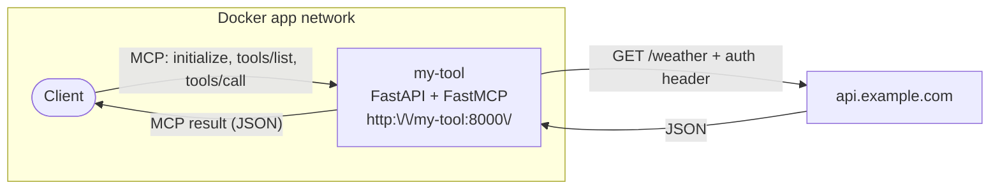

# Building an MCP tool

Taking an external HTTP API and exposing it as a **Streamable HTTP MCP server** that Open WebUI (or any MCP client) can
call as a tool. The tool function is a deterministic wrapper around one API call.

## Table of contents

1. [What this guide is for](#1-what-this-guide-is-for)
2. [Prerequisites](#2-prerequisites)
3. [Mental model](#3-mental-model)
4. [The minimal MCP tool](#4-the-minimal-mcp-tool)
5. [A real-world tool](#5-a-real-world-tool)
6. [FastAPI coexistence — health and MCP at the same port](#6-fastapi-coexistence--health-and-mcp-at-the-same-port)
7. [Plugging into Open WebUI](#7-plugging-into-open-webui)
8. [Caching (when it's worth it)](#8-caching-when-its-worth-it)
9. [Plugging into the parent stack](#9-plugging-into-the-parent-stack)
10. [Testing](#10-testing)
11. [Verification checklist](#11-verification-checklist)
12. [Common pitfalls / FAQ](#12-common-pitfalls--faq)
13. [Reference index](#13-reference-index)

---

## 1. What this guide is for

You've got an external API — a weather service, an address-lookup endpoint, an internal CRM — and you want **Open WebUI
** (or any other MCP client) to call it as a tool. The vehicle for that is an **MCP server**: your code exposes one or
more *tools* over the Model Context Protocol; the MCP client (Open WebUI, Claude Desktop, etc.) discovers them via
`tools/list` and invokes them via `tools/call`.

The canonical real-world example in this org is [AarhusAI/search-agent](https://github.com/AarhusAI/search-agent),
which wraps a SearXNG search endpoint as an MCP server. This guide is the same shape with a generic weather example.

**Not in scope:**

- LLM-backed workflows or agentic loops — start with [the agent guide](./agentic_tool.md). The `@agent.tool` decorator
  from PydanticAI is a different "tool" concept and lives inside an agent process; this guide is about
  *MCP-protocol* tools that external clients call.
- The older HTTP+SSE MCP transport — superseded by Streamable HTTP; not covered.
- Long-running batch jobs — a task runner / cron suits those better.

## 2. Prerequisites

- Read [the agent guide](./agentic_tool.md) §1–§7 first. This guide reuses the same skeleton (FastAPI, Taskfile, Docker,
  networks) and only covers what's MCP-specific.
- A target external API with a documented HTTP contract: known endpoint, request shape, response shape, error codes,
  auth method.
- A clone of `openwebui-docker` running locally so your tool sits on the `app` and `frontend` networks.
- One sentence of MCP background: an MCP server exposes named **tools** (functions with typed parameters); clients
  list and call them over JSON-RPC. The official spec is at [modelcontextprotocol.io](https://modelcontextprotocol.io/).

## 3. Mental model

The MCP client speaks to a single endpoint on your server using JSON-RPC over HTTP. Your server registers one or more *
*tool functions**; each call routes to the matching function, which calls the upstream API and returns the result.



The wrapper exists to centralise three things — upstream auth (your tool holds the API key, not the client), error
normalisation (every caller sees the same error shape), and observability (you log and metric in one place).

> **"Tool" is overloaded.** This guide is about *MCP* tools — functions exposed to external clients over the MCP
> protocol. [The agent guide](./agentic_tool.md) §8 covers *PydanticAI* tools — `@agent.tool` functions called from
> inside an agent's own LLM loop. They are unrelated despite the shared word.

## 4. The minimal MCP tool

The smallest working MCP server — one tool that calls the API and returns a result. Drop it into the §7 skeleton from
[the agent guide](./agentic_tool.md), with one extra dependency.

Add `mcp[cli]>=1.0` to `pyproject.toml`:

```toml
[project]
dependencies = [
    "fastapi>=0.115.0",
    "uvicorn[standard]>=0.30.0",
    "pydantic>=2.0",
    "pydantic-settings>=2.0",
    "httpx>=0.27.0",
    "mcp[cli]>=1.0",
]
```

`app/mcp_server.py`:

```python
import json

import httpx
from mcp.server.fastmcp import FastMCP

mcp = FastMCP("my-tool")


@mcp.tool()
async def get_weather(city: str) -> str:
    """Get the current weather for a city.

    Use this when the user asks about current conditions, temperature, or
    precipitation. Returns a JSON string with city, temperature in Celsius,
    and a short description of conditions.
    """
    async with httpx.AsyncClient(timeout=10) as client:
        resp = await client.get(
            "https://api.example.com/weather",
            params={"city": city},
        )
        resp.raise_for_status()
        payload = resp.json()

    return json.dumps({
        "city": payload["city"],
        "temperature_c": payload["current"]["temp_c"],
        "conditions": payload["current"]["conditions"],
    })
```

`app/main.py` - mount the MCP server on FastAPI and wrap the lifespan with the MCP session manager:

```python
from contextlib import asynccontextmanager

from fastapi import FastAPI

from app.mcp_server import mcp


@asynccontextmanager
async def lifespan(app: FastAPI):
    async with mcp.session_manager.run():
        yield


app = FastAPI(title="My Tool", lifespan=lifespan)


@app.get("/health")
async def health():
    return {"status": "ok"}


app.mount("/", mcp.streamable_http_app())
```

That's enough to run. `task up`, then verify with an `initialize` call:

```bash
curl -X POST http://localhost:8000/ \
     -H "Content-Type: application/json" \
     -H "Accept: application/json, text/event-stream" \
     -d '{"jsonrpc":"2.0","id":1,"method":"initialize","params":{"protocolVersion":"2024-11-05","capabilities":{},"clientInfo":{"name":"curl","version":"0"}}}'
```

You should get back a JSON-RPC response listing the server's capabilities. The rest of this guide makes the tool
production-ready.

---

## 5. A real-world tool

### 5.1 Module-level httpx client

Creating an `httpx.AsyncClient` per call wastes connections. Lift it to module scope with lazy init, mirroring the
pattern from [the agent guide §7.9](./new-agent.md#79-routes-and-services). Put it in `app/services/weather.py`:

```python
import httpx

from app.config import settings

_client: httpx.AsyncClient | None = None


def _get_client() -> httpx.AsyncClient:
    global _client
    if _client is None:
        _client = httpx.AsyncClient(
            base_url=settings.weather_api_base_url,
            headers={"Authorization": f"Bearer {settings.weather_api_key}"},
            timeout=httpx.Timeout(10.0, connect=3.0),
        )
    return _client


async def close_client() -> None:
    global _client
    if _client is not None:
        await _client.aclose()
        _client = None
```

Close the client on shutdown by extending the lifespan from §4 (full version shown in §6).

### 5.2 Service layer

Move the HTTP call out of the tool function into `app/services/weather.py`. The MCP tool stays thin (signature plus
shaping the return value); the service holds the actual work.

```python
# app/services/weather.py
async def fetch_weather(city: str, units: str) -> dict:
    client = _get_client()
    resp = await client.get("/weather", params={"city": city, "units": units})
    resp.raise_for_status()
    return resp.json()
```

### 5.3 The MCP tool

Update the tool to call the service and return a shaped JSON string. The function signature is the **public contract**:
parameter names, type hints, and the docstring all become part of the schema MCP clients see.

```python
# app/mcp_server.py
import json
from typing import Literal

from mcp.server.fastmcp import FastMCP

from app.services.weather import fetch_weather

mcp = FastMCP("my-tool")


@mcp.tool()
async def get_weather(
    city: str,
    units: Literal["metric", "imperial"] = "metric",
) -> str:
    """Get the current weather for a city.

    Use this when the user asks about current conditions, temperature, or
    precipitation. Do not use it for forecasts more than 24 hours out — this
    API only returns current observations.

    Args:
        city: City name in English (e.g. "Aarhus", "Copenhagen").
        units: "metric" for Celsius/km, "imperial" for Fahrenheit/miles.
    """
    payload = await fetch_weather(city, units)
    return json.dumps({
        "city": payload["city"],
        "temperature_c": payload["current"]["temp_c"],
        "conditions": payload["current"]["conditions"],
        "observed_at": payload["current"]["observed_at"],
    })
```

Two rules:

- **Precise types in the signature.** `Literal["metric", "imperial"]` becomes an enum in the JSON schema clients see;
  callers (or the LLM driving them) can't invent values outside the set.
- **The docstring is the model's instruction manual.** First line becomes the tool description; the rest tells the
  client *when* to call it. Write it like help text for a teammate.

The MCP SDK accepts several return types (string, dict, list, pydantic model). Returning a **JSON string** is the most
portable shape across SDK versions and matches what search-agent does.

### 5.4 Inbound transport security

MCP's Streamable HTTP transport doesn't use bearer tokens by default — it uses **host validation**: the server only
accepts requests whose `Host` header is on an allowlist. This prevents DNS-rebinding attacks against MCP servers that
sit on `localhost` or internal hostnames.

Configure it on the `FastMCP` instance:

```python
# app/mcp_server.py
from mcp.server.fastmcp import FastMCP
from mcp.server.transport_security import TransportSecuritySettings

from app.config import settings

mcp = FastMCP(
    "my-tool",
    transport_security=TransportSecuritySettings(
        allowed_hosts=settings.mcp_allowed_hosts,
    ),
)
```

And in `app/config.py`:

```python
class Settings(BaseSettings):
    mcp_allowed_hosts: list[str] = [
        "my-tool:8000",        # service-to-service inside the app network
        "localhost:8000",      # local curl/dev
    ]
```

When Open WebUI calls your tool, it sends the upstream `Host` header it was configured to use; that host **must** be
on the allowlist. Production deployments add their public hostname (e.g. `my-tool.itkdev.dk`) here too.

If you also need bearer-token auth on the inbound side (to prevent any other container on the same network from
calling your tool), wrap the MCP mount in a FastAPI middleware that checks an `Authorization` header before the
request reaches the MCP app. The transport-security allowlist is a baseline; layered auth is fine.

### 5.5 Outbound auth (upstream API)

Same pattern as a regular HTTP service. The upstream API key lives in `Settings`:

```python
# app/config.py
class Settings(BaseSettings):
    weather_api_key: str  # required — no default
    weather_api_base_url: str = "https://api.example.com"
    mcp_allowed_hosts: list[str] = ["my-tool:8000", "localhost:8000"]
```

It's injected on the long-lived client (§5.1). Document everything in `.env.example`:

```bash
# Outbound — upstream API
WEATHER_API_KEY=
WEATHER_API_BASE_URL=https://api.example.com

# Inbound — MCP transport security
MCP_ALLOWED_HOSTS=["my-tool:8000","localhost:8000"]
```

### 5.6 Error handling

The MCP SDK surfaces any exception raised inside a `@mcp.tool()` function as a JSON-RPC error to the client. Don't use
FastAPI's `HTTPException` — it only works for HTTP routes, not for MCP tool functions.

Raise a plain exception with a useful message:

```python
# app/services/weather.py
import httpx
import logging

log = logging.getLogger(__name__)


class WeatherError(RuntimeError):
    """Raised when the upstream weather API can't fulfil a request."""


async def fetch_weather(city: str, units: str) -> dict:
    client = _get_client()
    try:
        resp = await client.get("/weather", params={"city": city, "units": units})
        resp.raise_for_status()
    except httpx.HTTPStatusError as exc:
        if exc.response.status_code == 404:
            raise WeatherError(f"City not found: {city}") from exc
        if 400 <= exc.response.status_code < 500:
            raise WeatherError("Invalid request to weather API") from exc
        log.warning("Weather API 5xx for %s: %s", city, exc)
        raise WeatherError("Upstream weather service unavailable") from exc
    except (httpx.TimeoutException, httpx.TransportError) as exc:
        log.warning("Weather API transport error for %s: %s", city, exc)
        raise WeatherError("Weather service timed out") from exc

    return resp.json()
```

The MCP client receives a JSON-RPC error with `code` and `message` fields. The message becomes user-visible in
the client, so keep it short and human-friendly.

### 5.7 Timeouts

Two distinct timeouts, plus a third that's not yours to set:

| Layer       | Set via                              | Typical value | What it bounds                          |
|-------------|--------------------------------------|---------------|-----------------------------------------|
| Per request | `httpx.Timeout` on the client (§5.1) | 10s           | One outbound HTTP call to the upstream  |
| Server-side | Uvicorn keep-alive / Traefik         | 60–120s       | Total request handling time             |
| Client-side | Client's MCP request timeout         | 60s default   | What the caller waits before giving up  |

Rule of thumb: a single upstream call should be ≤ 10s. If the API is regularly slower, either cache (§8) or rethink
whether this needs to be a synchronous MCP tool at all.

## 6. FastAPI coexistence — health and MCP at the same port

Your service is one FastAPI app: regular routes (health, debug) coexist with the MCP mount. The lifespan **must** wrap
`yield` with `async with mcp.session_manager.run():` — without it the MCP endpoint accepts requests but can't handle
them, and every call returns a 500.

```python
# app/main.py
import logging
from contextlib import asynccontextmanager

from fastapi import FastAPI

from app.config import settings
from app.mcp_server import mcp
from app.services import weather

logging.basicConfig(level=logging.INFO)
log = logging.getLogger(__name__)


@asynccontextmanager
async def lifespan(app: FastAPI):
    log.info("Starting %s with allowed hosts %s", app.title, settings.mcp_allowed_hosts)
    async with mcp.session_manager.run():
        yield
    await weather.close_client()
    log.info("%s shut down", app.title)


app = FastAPI(title="My Tool", lifespan=lifespan)


@app.get("/health")
async def health():
    return {"status": "ok"}


@app.get("/health/ready")
async def health_ready():
    try:
        client = weather._get_client()
        await client.head("/")
        return {"status": "ok"}
    except Exception as exc:
        log.warning("Readiness check failed: %s", exc)
        return {"status": "error", "detail": str(exc)}


app.mount("/", mcp.streamable_http_app())
```

**Mount order matters.** `app.mount("/", ...)` claims the root path. Add any non-MCP routes (`/health`,
`/health/ready`, `/debug/...`) **before** the mount. Routes registered before a mount on `/` continue to win for
their specific paths.

---

## 7. Plugging into Open WebUI

Open WebUI's MCP client speaks Streamable HTTP, which is what this guide builds — so registration is
configuration-only, no code changes.

What Open WebUI needs:

- **The MCP endpoint URL.** Inside the `app` network it's `http://my-tool:8000/`. From a host browser or a remote
  client, use the Traefik-routed public URL.
- **The host you registered with Open WebUI must be on the allowlist** (§5.4). If Open WebUI hits
  `http://my-tool:8000/`, then `my-tool:8000` must be in `MCP_ALLOWED_HOSTS`. If it hits a Traefik hostname, add that
  too.

In Open WebUI, register the tool under **Settings → Tools → MCP servers** (exact path moves between releases — check
the running version). The fields you typically need:

| Field         | Value                                                |
|---------------|------------------------------------------------------|
| Name          | `my-tool`                                            |
| Transport     | Streamable HTTP                                      |
| URL           | `http://my-tool:8000/`                               |
| Auth (if any) | Bearer token, only if you layered one on top of §5.4 |

Open WebUI calls `initialize` and `tools/list` on registration. If the host is allowlisted and the lifespan is wrapped
correctly, your `get_weather` tool appears immediately and can be enabled per-conversation.

---

## 8. Caching (when it's worth it)

Cache only if **all three** hold:

- The API is **idempotent** for the same arguments.
- The API is **slow** or **rate-limited** — caching avoids the cost.
- Stale-by-a-bit data is **acceptable** for your use case.

Cache at the **service layer** (`fetch_weather`), not at the MCP layer — the service is the only place that knows
which upstream calls are expensive.

`functools.lru_cache` doesn't work with `async def` — it caches coroutine objects, not their results. Use a small
TTL-aware dict, or `async-lru`:

```python
import time

_cache: dict[tuple, tuple[float, dict]] = {}
_TTL_SECONDS = 600


def _cached(key: tuple) -> dict | None:
    entry = _cache.get(key)
    if entry is None:
        return None
    expires_at, value = entry
    if time.time() > expires_at:
        del _cache[key]
        return None
    return value


async def fetch_weather(city: str, units: str) -> dict:
    key = ("weather", city.lower(), units)
    if (hit := _cached(key)) is not None:
        return hit

    # ... existing fetch logic ...
    _cache[key] = (time.time() + _TTL_SECONDS, payload)
    return payload
```

Caveats:

- **Cache key must include every argument.** Forgetting `units` means metric callers get imperial cached results.
- **Never cache errors.** A transient 503 will poison the cache for the whole TTL.
- For multi-replica deployments, an in-process cache means cache misses on most requests. If that matters, use Redis
  on the `app` network instead.

---

## 9. Plugging into the parent stack

The FastAPI skeleton, Dockerfile, Taskfile, networks, and parent-stack integration are **identical** to
[the agent guide](./agentic_tool.md) — same boilerplate, same conventions. Specifically:

- **Skeleton + `pyproject.toml`** — [§7](./new-agent.md#7-step-by-step-setup). Drop `pydantic-ai-slim` from
  `dependencies`; add `mcp[cli]>=1.0`.
- **Dockerfile** — [§7.3](./new-agent.md#73-dockerfile). No model cache needed.
- **docker-compose.yml** — [§7.4](./new-agent.md#74-docker-composeyml). Same networks, same Traefik labels.
- **Taskfile.yml** — [§7.5](./new-agent.md#75-taskfileyml). Verbatim copy.
- **Lifespan + health** — see §6 above; the lifespan must wrap `yield` with `mcp.session_manager.run()`.
- **Embedding in the parent stack** — [§9](./new-agent.md#9-integrating-with-the-parent-stack). Same dev/prod split,
  same `image:` reference pattern. **Add `MCP_ALLOWED_HOSTS` to the env block**, including every hostname Open WebUI
  will use to reach you.
- **Multi-arch image build** — [§10](./new-agent.md#10-production-builds-multi-arch). Verbatim.

The only delta is what's in `app/mcp_server.py` and `app/services/` — the FastMCP setup, the tool registration, and
the service-layer API wrapper.

---

## 10. Testing

Two layers: service-layer with `respx`, MCP-layer with a direct call to the tool function.

Add `respx` to dev deps in `pyproject.toml`:

```toml
[project.optional-dependencies]
dev = [
    # ... existing ...
    "respx>=0.21",
]
```

### Service-layer tests

`tests/services/test_weather.py`:

```python
import pytest
import respx
from httpx import Response

from app.services import weather
from app.services.weather import WeatherError, fetch_weather


@pytest.fixture(autouse=True)
def _reset_client():
    yield
    weather._client = None


@respx.mock
async def test_fetch_weather_happy_path():
    respx.get("https://api.example.com/weather").mock(
        return_value=Response(200, json={
            "city": "Aarhus",
            "current": {
                "temp_c": 14,
                "conditions": "Partly cloudy",
                "observed_at": "2026-05-18T12:00:00Z",
            },
        }),
    )

    result = await fetch_weather("Aarhus", "metric")

    assert result["city"] == "Aarhus"


@respx.mock
async def test_fetch_weather_404_raises_weather_error():
    respx.get("https://api.example.com/weather").mock(return_value=Response(404))

    with pytest.raises(WeatherError, match="City not found"):
        await fetch_weather("Atlantis", "metric")


@respx.mock
async def test_fetch_weather_5xx_raises_weather_error():
    respx.get("https://api.example.com/weather").mock(return_value=Response(503))

    with pytest.raises(WeatherError, match="unavailable"):
        await fetch_weather("Aarhus", "metric")
```

### MCP-layer tests

Invoke the tool function directly. FastMCP exposes the underlying coroutine via `.fn` on the decorated object:

```python
import json

import respx
from httpx import Response

from app.mcp_server import get_weather


@respx.mock
async def test_get_weather_returns_json_string():
    respx.get("https://api.example.com/weather").mock(
        return_value=Response(200, json={
            "city": "Aarhus",
            "current": {
                "temp_c": 14,
                "conditions": "Partly cloudy",
                "observed_at": "2026-05-18T12:00:00Z",
            },
        }),
    )

    result_json = await get_weather.fn("Aarhus", "metric")
    result = json.loads(result_json)

    assert result == {
        "city": "Aarhus",
        "temperature_c": 14,
        "conditions": "Partly cloudy",
        "observed_at": "2026-05-18T12:00:00Z",
    }
```

For full integration tests (Streamable HTTP transport, real JSON-RPC framing) drive the FastAPI app with
`httpx.AsyncClient` against the mounted endpoint — same approach as the agent guide §7.10 ASGI fixture. Most
projects find the unit tests above sufficient.

The `conftest.py` env-before-import rule from [the agent guide §7.10](./new-agent.md#710-testsconftestpy) still
applies — set `WEATHER_API_KEY` and `MCP_ALLOWED_HOSTS` before `from app.main import app`.

---

## 11. Verification checklist

Before declaring the tool done:

- [ ] **Skeleton builds.** `task build` from a clean checkout.
- [ ] **Service starts healthy.** `task up`; `docker compose ps` shows `(healthy)`.
- [ ] **Health endpoints respond.** `/health` always 200; `/health/ready` 200 when upstream is reachable,
  503 otherwise.
- [ ] **MCP `initialize` works.** From `task shell`, the `curl` from §4 returns a JSON-RPC result with the server's
  capabilities.
- [ ] **MCP `tools/list` shows your tool.** Schema matches the function signature (parameters, enum values,
  description).
- [ ] **MCP `tools/call` succeeds.** Calling `get_weather` with a valid city returns the expected JSON payload.
- [ ] **Transport security blocks wrong hosts.** A request with a `Host` header not on `MCP_ALLOWED_HOSTS` is
  rejected.
- [ ] **Upstream 4xx → meaningful error.** Unknown city → JSON-RPC error with the `City not found` message.
- [ ] **Upstream 5xx / timeout → meaningful error.** Point `WEATHER_API_BASE_URL` at `http://127.0.0.1:1` and confirm
  the MCP error mentions unavailability or timeout.
- [ ] **`close_client()` is wired in `lifespan`.** Otherwise CI leaks connections.
- [ ] **`.env.example` documents every env var.** `WEATHER_API_KEY`, `WEATHER_API_BASE_URL`, `MCP_ALLOWED_HOSTS`.
- [ ] **Open WebUI registers the tool.** With the URL and allowlisted host, the tool appears in Open WebUI's tool
  list and answers a real prompt end-to-end.
- [ ] **`task ci` is green.** Lint + format + tests.

---

## 12. Common pitfalls / FAQ

**1. Tool calls return 500, never reach my function.**
The lifespan is missing `async with mcp.session_manager.run():` around `yield`. The Streamable HTTP transport needs
that session manager to dispatch JSON-RPC calls. See §6.

**2. Open WebUI says "MCP server unreachable" but `curl` works.**
Host mismatch: Open WebUI sends a `Host` header your `MCP_ALLOWED_HOSTS` doesn't include. Add Open WebUI's hostname
(the one it uses to reach you, not its own public hostname) to the allowlist and restart.

**3. `HTTPException` from the tool isn't reaching the client.**
`HTTPException` is FastAPI-only — it works for HTTP routes, not for MCP tool functions. Raise a plain exception
instead; the MCP SDK turns it into a JSON-RPC error (§5.6).

**4. The tool returns 200 but the response body is empty / weird.**
Almost always a return-type issue. Return a JSON-serialisable **string** or **dict** from `@mcp.tool()` functions —
returning a pydantic model directly works on newer SDK versions but is fragile across upgrades. Use `json.dumps(...)`
to be safe.

**5. Mount path collisions.**
`app.mount("/", mcp.streamable_http_app())` claims the root path; any non-MCP route you want (health, debug) must be
registered **before** the mount. If a route is registered after the mount, the mount wins.

**6. "Why do I see two kinds of 'tool' in our docs?"**
[The agent guide §8](./new-agent.md#8-pydanticai-patterns) covers PydanticAI `@agent.tool` — Python functions called
from inside an *agent's own LLM loop*. This guide covers MCP tools — functions exposed to *external clients* over the
MCP protocol. Different concepts, same word. A service can do both (search-agent does), but for most cases you want
one or the other.

**7. Tests pass locally, fail in CI with `ConnectError`.**
`respx` only intercepts inside its context manager (`@respx.mock` or `with respx.mock():`). If a test forgets the
decorator the real HTTP call fires against `api.example.com` and you get a transport error. The autouse fixture
resetting `_client` to `None` (§10) is essential.

---

## 13. Reference index

| Resource                                                                 | What it gives you                              |
|--------------------------------------------------------------------------|------------------------------------------------|
| [The agent guide §6](./new-agent.md#6-repository-layout)                 | Routes/services split; project layout          |
| [The agent guide §7](./new-agent.md#7-step-by-step-setup)                | Reusable FastAPI/Docker/Taskfile skeleton      |
| [The agent guide §7.10](./new-agent.md#710-testsconftestpy)              | Env-before-import test setup                   |
| [The agent guide §9](./new-agent.md#9-integrating-with-the-parent-stack) | Networking, parent-stack embedding             |
| [AarhusAI/search-agent](https://github.com/AarhusAI/search-agent)        | Canonical real-world MCP server in this org    |
| [Python MCP SDK](https://github.com/modelcontextprotocol/python-sdk)     | API reference for `FastMCP`, transports, tools |
| [MCP spec](https://modelcontextprotocol.io/)                             | Transport-level details and JSON-RPC framing   |
| [respx](https://lundberg.github.io/respx/)                               | httpx mocking library used in tests            |
